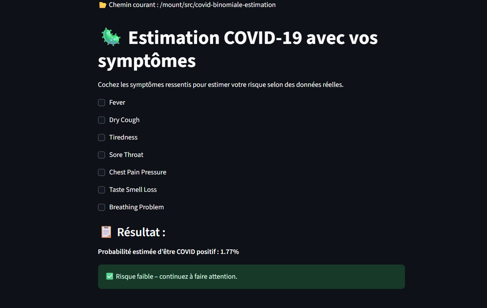
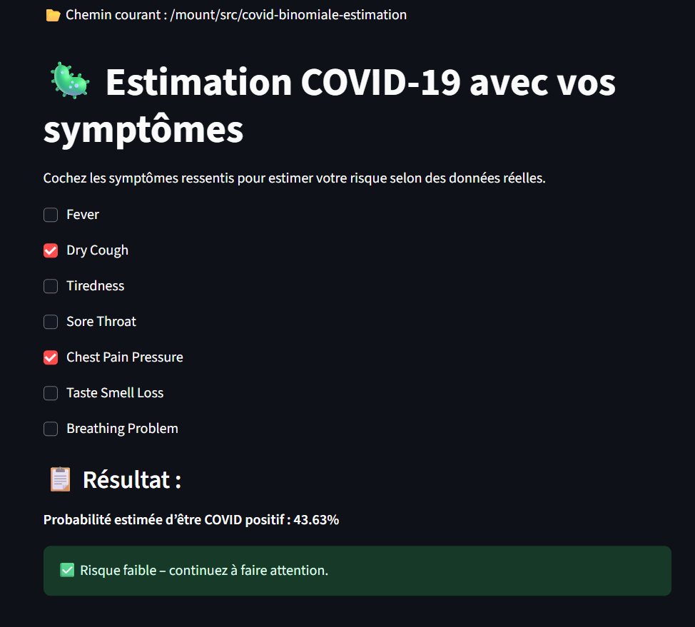
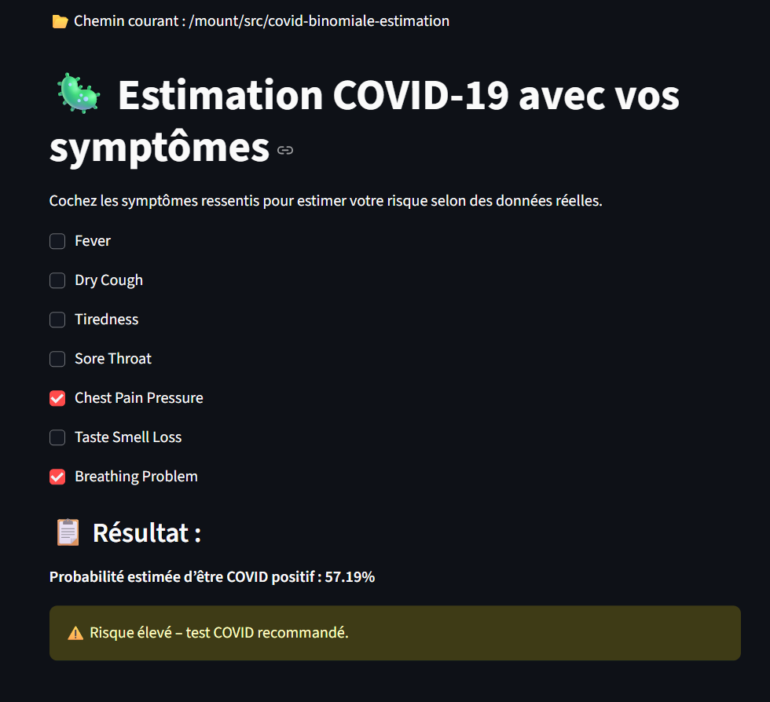

# 🦠 Estimation de Probabilité COVID-19 à partir de Symptômes

Ce projet permet à un utilisateur de cocher des symptômes cliniques et d'obtenir une estimation de la probabilité d'être atteint du COVID-19, à l'aide d'un modèle probabiliste basé sur la loi de Bayes.

---

## 📌 Objectif

Estimer la probabilité d'infection COVID-19 en fonction des symptômes renseignés par l'utilisateur, selon les données d'observation issues d'un dataset réel.

---

## 📊 Données utilisées

- **Source** : [Mendeley Data - COVID19 Symptoms Dataset](https://data.mendeley.com/datasets/4ddz9385xp/1)
- **Colonnes importantes** :
  - `Fever`, `Dry_Cough`, `Tiredness`, `Sore_Throat`, `Chest_Pain_Pressure`, `Taste_Smell_Loss`, `Breathing_Problem`
  - `Covid_Test_Result` (0 = Négatif, 1 = Positif)

---

## 📊 Modèle statistique utilisé

Chaque symptôme est modélisé comme une **épreuve de Bernoulli** :  
Soit `X_i = 1` si le symptôme *i* est présent, `0` sinon.  
La somme `S = X₁ + X₂ + ... + Xₙ` suit une **loi binomiale** :  
**S ~ B(n, p)** avec `n = nombre de symptômes` et `p = probabilité d’être malade si un symptôme est présent`.

## 📊 Méthode statistique utilisée

L'application repose sur la **loi binomiale** pour modéliser la probabilité qu'un patient soit infecté en fonction de la présence de plusieurs symptômes.

### 🔍 Hypothèse

- Chaque symptôme est considéré comme une épreuve indépendante de type **présent / absent**.
- La présence d’un symptôme augmente la probabilité que le patient soit infecté.
- Soit :
  - `n` : nombre total de symptômes étudiés
  - `k` : nombre de symptômes présents chez un patient
  - `p` : probabilité individuelle qu’un symptôme indique le COVID (fixée selon le modèle ou estimée)

### 📐 Modélisation

On modélise le nombre de symptômes présents `k` par une variable aléatoire suivant une loi binomiale :

> **X ~ B(n, p)**

L'application utilise la fonction de répartition ou de masse de la loi binomiale pour :

- Calculer la **probabilité que `k` symptômes soient présents**
- Estimer la **probabilité que le patient soit effectivement infecté**, à partir du nombre de symptômes déclarés

### 📌 Interprétation

Une forte valeur de `k` (plusieurs symptômes présents) donne une probabilité plus élevée que le patient soit positif.  
La visualisation permet de situer `k` sur la courbe de la distribution binomiale.

---

## 🚀 Utilisation

### 1. Prérequis

Installez les bibliothèques nécessaires :

```bash
pip install streamlit pandas
````

### 2. Lancer l’application

```bash
streamlit run covid.py
```

### 3. Interface utilisateur

* Cochez les symptômes que vous ressentez.
* Le système calcule la probabilité d’être COVID positif.
* Un message vous informe du risque estimé.

---

## 📁 Arborescence du projet

```
covid-probability-app/
├── covid.py               # Code principal de l'application Streamlit
├── COVID19_symptoms.csv   # Fichier de données depuis Mendeley
└── README.md              # Ce fichier d'explication
```


## 🚀 Accès à l'application

👉 [🧪 Lancer l'application en ligne](https://covid-binomiale-estimation.streamlit.app/)

---

## 💡 Exemple d’utilisation

1. Entrez une séquence de symptômes sous forme binaire ou de scores (par ex. `1,0,1,1,0,0`) dans le champ prévu.
2. L’application calcule :
   - ✅ Le **nombre total de symptômes positifs**
   - 📊 La **probabilité d’infection estimée** selon la loi binomiale
   - 📈 Une **représentation graphique** de la distribution
3. Interprétez les résultats en fonction d’un seuil (par ex. `p > 0.5` → suspect COVID)
---
## 📄 Page 1 – Accueil de l’application

L'utilisateur saisit une séquence de symptômes dans le champ prévu (ex. : `1,0,1,1,0,0`).

<p align="center">
  
</p>

---

## 🟢 Page 2 – Résultat : COVID négatif (probabilité < 0.5)

Si la probabilité estimée est **inférieure à 50 %**, l’application indique que le patient est **peu susceptible d’être infecté**.

<p align="center">
  
</p>

> ✅ Interprétation : Le nombre de symptômes est faible → faible probabilité d’infection.

---

## 🔴 Page 3 – Résultat : COVID positif (probabilité > 0.5)

Si la probabilité estimée est **supérieure à 50 %**, l’application suggère une **forte probabilité d'infection**.

<p align="center">
  
</p>

> ⚠️ Interprétation : Plusieurs symptômes présents → probabilité élevée → cas suspect à tester.

---

## ⚙️ Installation locale (optionnel)

```bash
# Clonez le dépôt
git clone https://github.com/lorida0777/COVID-Binomiale-Estimation.git
cd COVID-Binomiale-Estimation/covid-probability-app

# Créez un environnement virtuel (optionnel)
python -m venv venv
source venv/bin/activate  # ou venv\Scripts\activate sur Windows

# Installez les dépendances
pip install -r ../requirements.txt

# Lancez l'app
streamlit run covid.py
````
## ✍️ Auteur

* **Nom :** \[ANDRIATSIFERANA No Kanto Lorida]
* **Projet académique :** Estimation probabiliste avec la loi de Bayes
* **Langage :** Python + Streamlit

